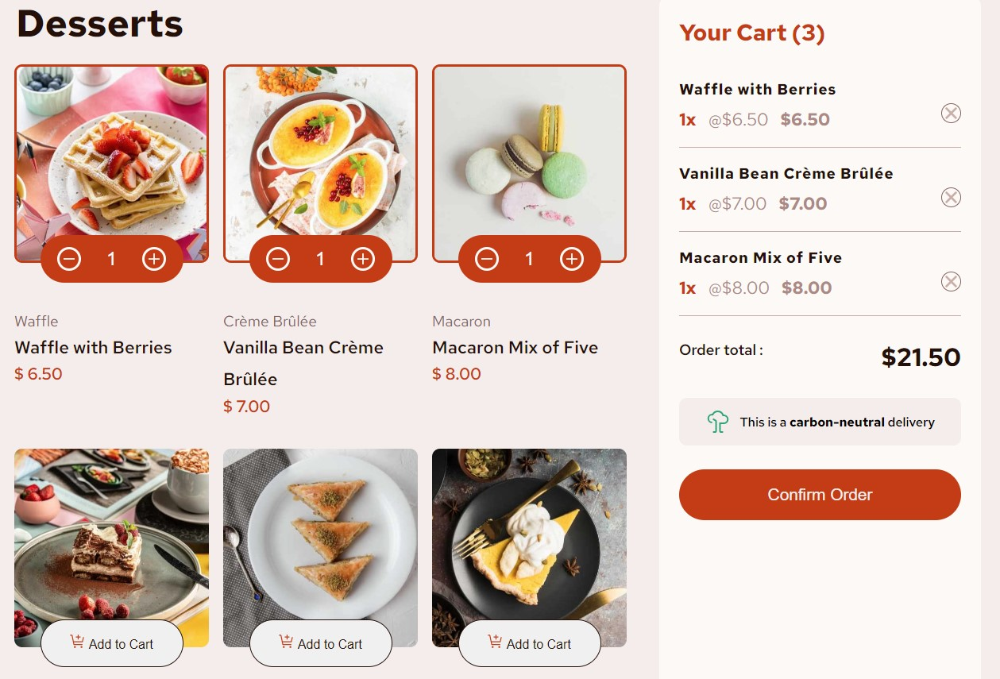

# Web-Design FrontEnd-Mentor

## Produción
1. Ejecutar ```npm run build```
2. Tomar la carpeta ```dist``` y desplegarla


## Vista previa-web



## Diseño UI/UX 
1. https://www.frontendmentor.io/challenges/product-list-with-cart-5MmqLVAp_d

